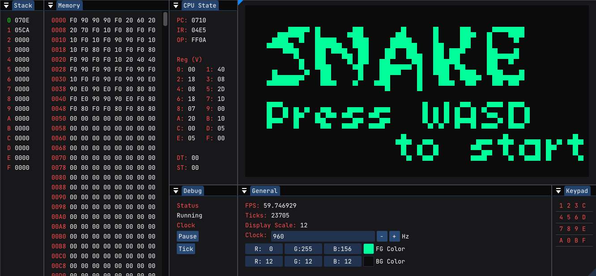

# Chip-8 interpreter in C++

Yet another [Chip-8](https://en.wikipedia.org/wiki/Chip-8) interpreter, this
time written in C++ using [GLFW](https://github.com/glfw/glfw) and OpenGL as its
graphics library. It uses [Dear ImGui](https://github.com/ocornut/imgui) to
draw the GUI.

### Why C++?

Because I wanted to get my hands dirty with modern C++. Last time I did C++ was
C++98 2 years ago for school.

### Screenies



_CPU Interface_

https://user-images.githubusercontent.com/15605299/137184651-490fa5b9-62a3-4274-b273-5b67c461552a.mp4

_Screen recording of the snake game_

### Building

In theory, it should run anywhere where Dear ImGui and C++ runs and OpenGL is
available. But I only tested it on Windows.

#### Windows

You will need `cmake`, `llvm`, `make` and `git`.

- ```$ git clone https://github.com/gargakshit/chip-8 --recursive```

  Use `--recursive` as the repo contains GLFW and Dear ImGui as submodules

- ```$ cmake -Bbuild -DCMAKE_C_COMPILER=clang -DCMAKE_CXX_COMPILER="clang++" -G "MinGW Makefiles" .```

  This will produce `MinGW Makefiles` with `clang++` as the `C++` compiler.
  You can add the flag `-DCMAKE_BUILD_TYPE=Release` to generate
  `MinGW Makefiles` for the release build. The release build is optimized and
  the debug interface is removed.

- ```$ cmake --build build```

  This will build the binary. If everything is successful, the interpreter
  binary will be produced with `build/chip8.exe` as the path. At this point,
  you could run your favorite `Chip-8` "ROMs" by dragging them and dropping it
  onto the binary in the file explorer, or by using a terminal and running
  `build/chip8 path/to/my/program.ch8`. I have included some programs
  in the `programs/` directory to play with (shout out to the original program
  authors)

You can also build with VS and MSVC toolchains, but I have not tested them
personally

### Is this any good?

Yes.
